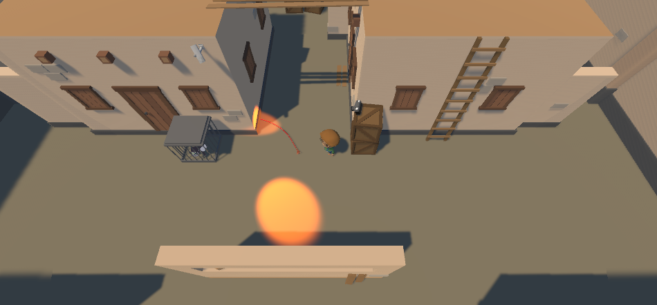

# Unity Object Oriented Programming Challenge

A stealth minigame that the player has to save animals from cages and avoid surveillance cameras to not be detected. Uses all four pillars of Object Oriented Programming as explained bellow.

## 1 - Inheritance

Parent/child relationships implemented with inheritance:

TrapCamera -> AlertCamera / SurveillanceCamera
AnimalRescue -> Monkey/Bird/Snake

## 2 - Polymorphism

Types and behaviors that objects can perform or can change depending of the subtype:

- All TrapCameras identify the player when he enters the field of view of the camera, but the surveillance camera rotate and the trap camera overrides the rotate function to do nothing and remains static.
- All AnimalRescue follows the player, but some animals follows in different ways

## 3 - Encapsulation

The relevant data about the objects are protected in the right way preventing misuse and application break.

## 4 - Abstraction

The code is clean and implements abstraction to hide unnecessary complexity, only exposing what is needed to make the code run as meant to. can be reusable reducing complexity and speeding up development.
